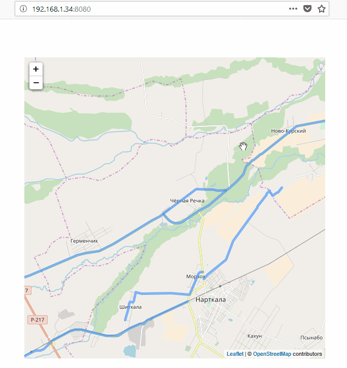

### DjangoDrawOnMaps
A simple service for drawing geographic coordinates from a database on a map.

Backend: ** Django **

Drawing coordinates: ** Leafletjs **

DBMS: ** SQLite **

To migrate model objects to an existing database with examples:

`python manage.py migrate --fake-initial`

Demo:

###### Author
[* Ulyantsev Alexander *](mailto:it.bumerang@gmail.com)

#### License
Licensed under license [MIT](LICENSE.txt)