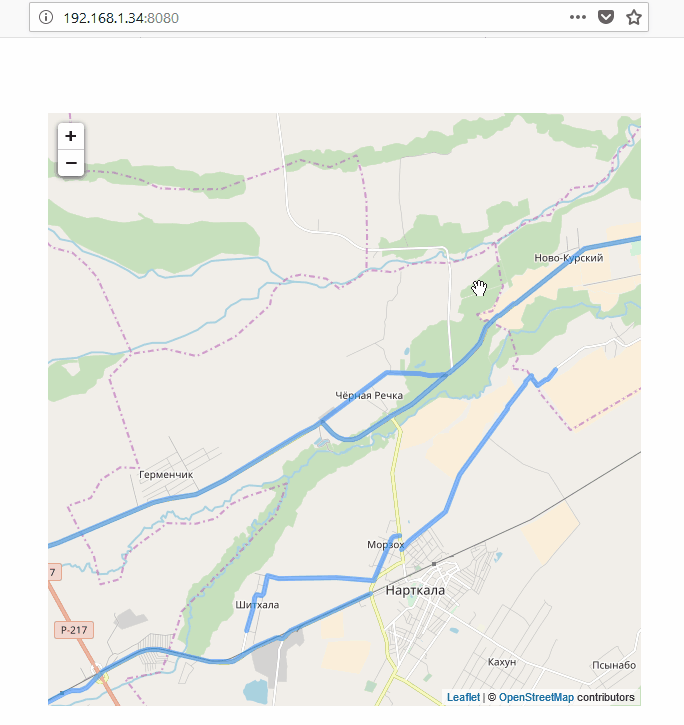

###DjangoDrawOnMaps
Простой сервис по отрисовке географических координат из БД на карте.

Backend: **Django**

Отрисовка координат: **Leafletjs**

СУБД: **SQLite**

Для миграции объектов модели на существующую БД с примерами:

` python manage.py migrate --fake-initial`

Демо:

###### Автор
[*Ульянцев Александр*](mailto:it.bumerang@gmail.com)

#### Лицензия
Лицензируется по лицензии [MIT](LICENSE.txt)